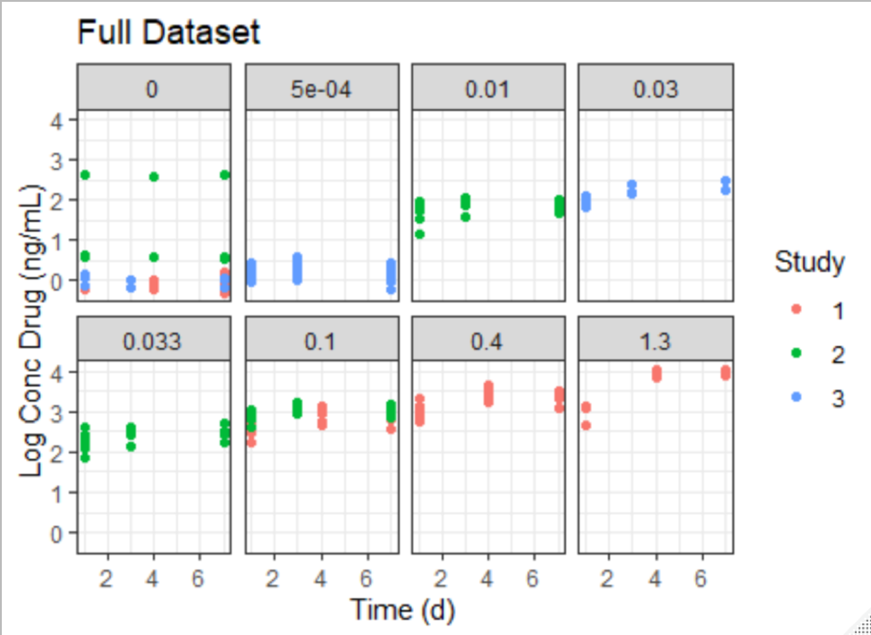
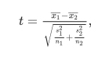
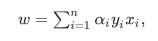
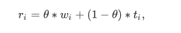
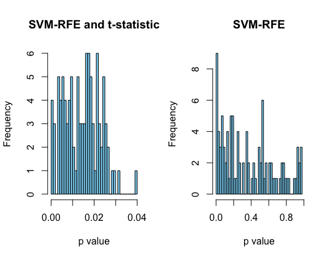
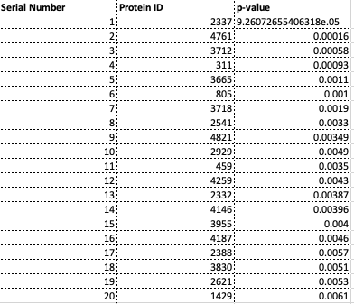

##Summary
In this project presented by Novartis during their 2019 Academia to Industry Quantitative Sciences Hackathon, I

* Compare Support Vector Machine with Recursive Feature Elemination(SVM-RFE) with a modified version of SVM-RFE with t-statistic(SVM-T-Statistic) to identify and classify proteins from SOMAscan that are most predictive of weight loss in obese monkeys. 

* Achieved higher classification accuracy with SVM-T-RFE method at dose 0.1mg/ml

* Identified top proteins for classification using both methods 

##Problem
Can we find the identify proteins that are most predictive of weight loss from SOMAscan assay in obese monkeys at a certain dose?

##Data description and pre-processing

The data we were presented were protein abundance measurements(rfu2) of 5080 proteins from SOMAscan assay generated simultaneously. These measurements were from 33 animals from 3 different studies injected with 8 different doses at 4 timepoints(day 0,1 ,4 and 7). Compound blood concentration at these different timepoints was also made available. We note that some of these monkeys were reused for these different studies.

For the purpose of our analysis, we assume that the animals reused for different studies were independent since they were one year apart. Since, we're interested in looking at dose-response relationship, our first task was to identify an appropriate dose to conduct our analysis.

The idea was to pick a dose where we has sufficient sample size and where log pk drug concentration wasn't to an extent where it could result in over-expression of protein. From Figure 1, we can see that dose 0.1 has the maximum number of animals(12) so we have sufficient sample size and it results in reasonable drug concentration in blood. 

percentage body weight change was recoded into factors where they were categorized as significant body weight loss(< -1) and little or no body weight loss(>= -1) in order to perform below described classification problem. All the rfu2 values were log transformed.
Protein measurements at timepoint 0 was excluded because we wanted to study the effects after the dose had been administered.

{width=500px}

##Approach

Since we have small sample and thousands of protein abundance data,  the selection of those proteins that are important for distinguishing the different sample classes being compared, poses a challenging problem in high dimensional data analysis. 

Below are some properties I based my model selection on: 

*   Scale to very high dimensions: methods should continue to generalize well even if the number of observed factors p significantly exceeds the number of observations n (p ≫ n) 

* Be interpretable: the output produced by the methods should be directly viable of biological and clinical interpretation, so black-box methods or complex manipulations of the features wasn't done

* 􏰀Biologically, protein expression is done in cascades. Thus, we would expect groups of proteins to be highly correlated with each other, representing the interplay of up and down-regulation. Hence, it is important to analyze the data jointly: low-dimensional probabilistic models or statistical tests ignore complex relationships between the predictors. We can see this from the correlation plot of 500 random proteins below.

SVM-RFE[1] is recognized as one of the most effective filtering methods for genes in the bioinfomatics world. It is based on an algorithm that finds the best possible combination for classification. The drawback of it, however, is that it does it without considering the differentially significant features between the classes. Features with notable classification accuracy and also differentially significant between the classes have a predominant role in a biological aspect. Hence, to overcome this limitation, in the proposed algorithm[2], t-statistics is included along with SVM-RFE.

##SVM-T-RFE algorithm

The primary objective of SVM-RFE with t-statistic as proposed by Xiaobo et al. [4]  

In this approach,

Firstly, we perform two sample Welch’s t-test on the dataset, the T-statistic is calculated as follows:

where n1 and n2 are the sizes of sample 1 and sample 2, and the other parameters are the mean and variances of each sample.

the ranking score[4] is calculated as below where $\theta$ parameter determines the tradeoff between SVM weight score and T-statistic, and θ is the value between 0 and 1. $w_i$ is weight from the original SVM-RFE where it's calculated as   

The performance of SVM–T-RFE protein selection algorithm depends upon θ. When θ is set to 0, the SVM weights are not taken into consideration. When θ is set to 1, T-statistic is not considered, and the SVM–T-RFE classifier is equal to the SVM-RFE classifier. 

We use $r_i$ to measure the importance of protein i for classification. The iteration process is followed by backward removal of the feature. The iteration process is continued until there is only one feature remaining in the dataset. The smallest ranking weight will be removed by the algorithm and stored in a stack, while remaining the feature variables have a significant impact for producing weight. Finally, the feature variables which are stored in the stack will be listed in the descending order of descriptive different degree.

##Modelling

In order to compare the performance of both SVM-T-RFE and SVM-RFE in classification,  a histogram of p values of the selected top 100 proteins is plotted.   The p values in the left histogram were calculated using t-statistic. We can see that for the model with t-statistics, all the p-values for the top 100 proteins is less than the generally accepted 0.05 while the range is much larger for the model with SVM-RFE. This is further illustrated by the boxplot below with p-value of 0.3 as the median for the second model. (done using sigFeature package in R)

##Validation

More work needs to be done in this regard since validating CV error using k-fold is computationally expensive.

However, to get a sense of model performance, the data was split into 80% training and 20% testing and the parameters from Table 1 were calculated with top 1000 proteins from each of these models.

We can see that SVM-RFE with t-statistics does a far better job of classifying weight loss than just SVM-RFE.

###List of Top 20 Proteins

Below are the list of top proteins from SVM-RFE and SVM-T-RFE. Interestingly, we notice that the target 1620 shows up as a top protein from the SVM-RFE model. This needs to be further investigated in this future.

##Conclusion and Future Directions:

High-demsional reduction is biomarker discovery is a hard problem. SVM-RFE and it's modified method SVM-T-RFE seem promising to identify suitable biomakers with reasonable predictive accuracy. Since project was done to satisfy a curiosity to test out an approach usually used in gene expression data with SOMAscan protein expressions. This approach makes no claims about the robustness of the identified proteins in playing a role in weight loss. However, it has brought certain proteins and dose to attention which can be further studied.

For the future steps,

* Validate this approach from different datasets of SOMAscan protein expression 

* Combine data-driven and expert knowledge-based approaches to concurrently mine the power of statistical algorithms for selection while guiding the process to include weighting factors derived from expert-knowledge. Bayesian approaches have always included weighting factors by assigning prior probabilities, but there are many different ways to accomplish this. This is both a problem of quantifying expert knowledge and of identifying the appropriate knowledge bases to utilize that capture expert knowledge pertinent to the question being posed.

* Explore different modifications of SVM-RFE such as SVM-RCE(support vector machine with recursive cluster elimination)[5] or SVM-RFE OA[6] since Support vector machine-recursive feature elimination (SVM-RFE) is an efficient feature selection technique that has shown its power in many applications.

##References:
1. Kai-Bo Duan, J. C. Rajapakse, Haiying Wang and F. Azuaje, "Multiple SVM-RFE for gene selection in cancer classification with expression data," in IEEE Transactions on NanoBioscience, vol. 4, no. 3, pp. 228-234, Sept. 2005.
2. Das, P., Roychoudhury, S., & Tripathy, S. (2017). sigFeature: An R-package for significant feature selection using SVM-RFE & t-statistic. Canadian Journal of Biotechnology, 1, 35. doi:http://dx.doi.org/10.24870/cjb.2017-a22
3. Zheng Rong Yang, Biological applications of support vector machines, Briefings in Bioinformatics, Volume 5, Issue 4, December 2004, Pages 328–338, https://doi.org/10.1093/bib/5.4.328
4. Xiaobo Li, Sihua Peng, Jian Chen, Bingjian Lü, Honghe Zhang, Maode Lai,
SVM–T-RFE: A novel gene selection algorithm for identifying metastasis-related genes in colorectal cancer using gene expression profiles,
Biochemical and Biophysical Research Communications
5. Yousef M, Jung S, Showe LC, Showe MK. Recursive cluster elimination (RCE) for classification and feature selection from gene expression data. BMC Bioinformatics. 2007;8:144. Published 2007 May 2. doi:10.1186/1471-2105-8-144
6. https://www.mdpi.com/248888

